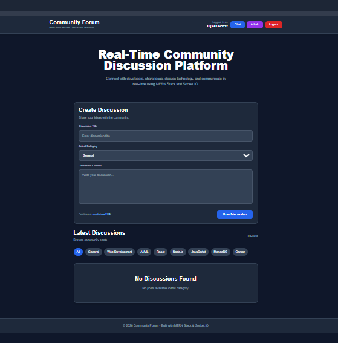
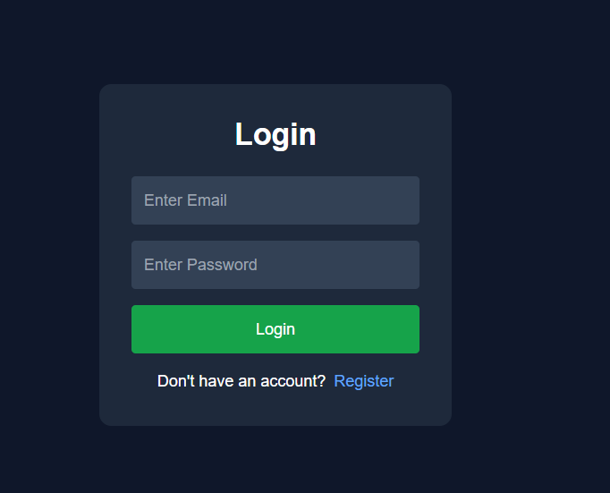
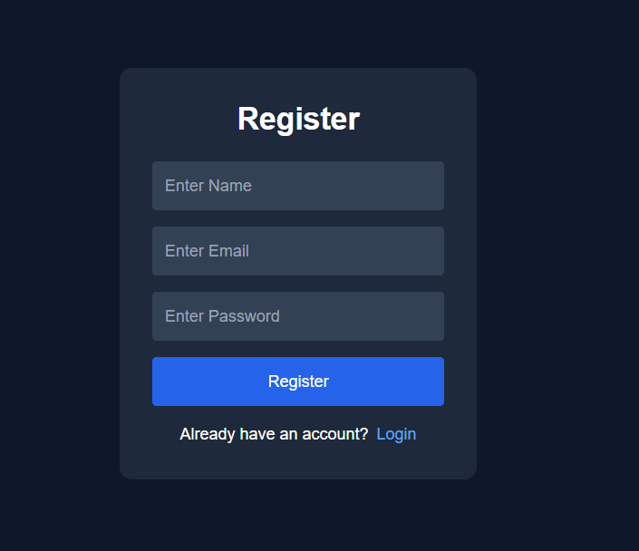
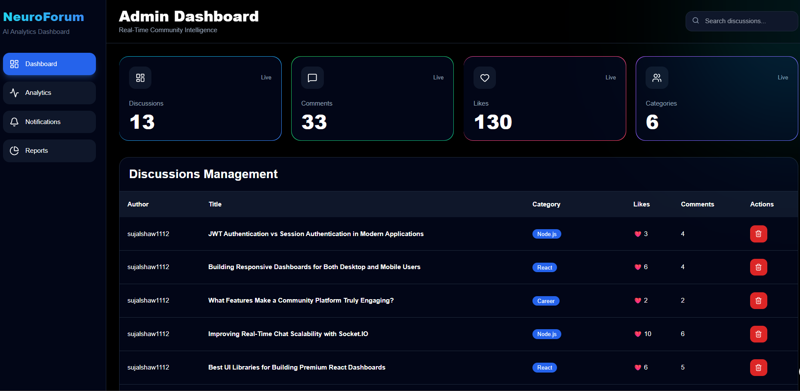
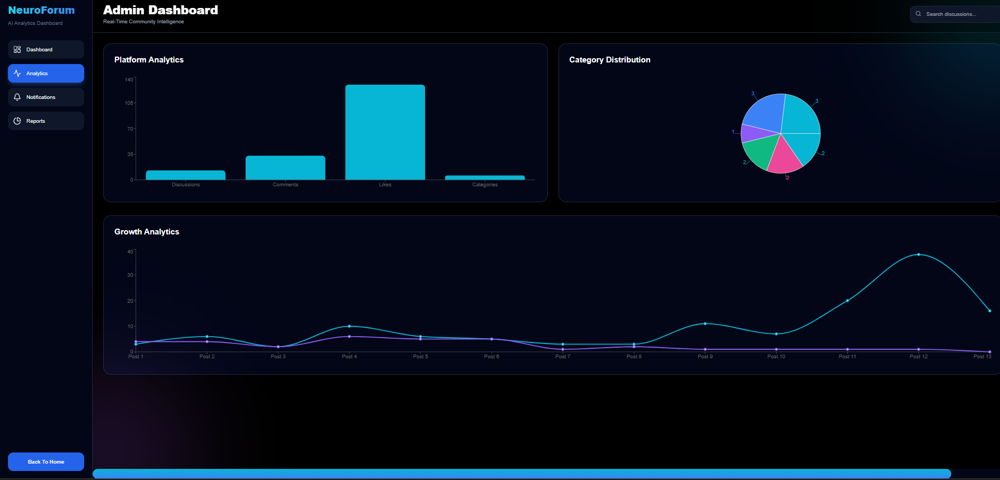
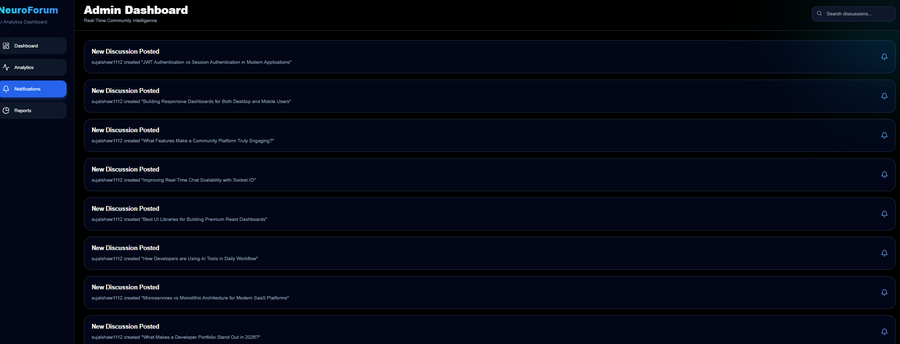
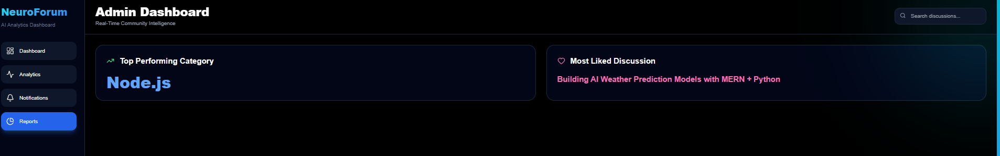

# 🚀 NeuroForum — Premium Real-Time MERN Community Platform

<p align="center">


</p>

---

# 🌌 Overview

NeuroForum is a modern full-stack MERN community platform designed with a premium SaaS-inspired interface and real-time communication architecture.

This platform enables users to:

✅ create technology discussions
✅ communicate in real-time
✅ interact using likes & comments
✅ monitor analytics through admin dashboard
✅ visualize platform growth using charts
✅ manage community interactions

The project was built to simulate a production-grade social collaboration & developer discussion platform using modern web technologies.

---

# ✨ Key Features

# 💬 Real-Time Chat System

* Socket.IO powered messaging
* Typing indicators
* Online user tracking
* Instant live communication
* Real-time updates

---

# ❤️ Community Engagement System

* Like discussions
* Comment system
* Dynamic post creation
* Real-time interaction
* Category filtering

---

# 📊 Premium Analytics Dashboard

* Platform analytics
* Interactive charts
* Growth tracking
* Category distribution
* Reports section
* Notifications panel
* Live metrics monitoring

---

# 🎨 Modern SaaS UI

Inspired by:

* OpenAI
* Vercel
* Discord
* Linear
* Notion

Includes:

* dark premium theme
* neon glow effects
* glassmorphism UI
* animated transitions
* responsive layouts
* modern dashboard design

---

# 🛠️ Tech Stack

| Frontend     | Backend    | Database        | Real-Time   |
| ------------ | ---------- | --------------- | ----------- |
| React.js     | Node.js    | MongoDB         | Socket.IO   |
| Vite         | Express.js | Mongoose        | WebSockets  |
| Tailwind CSS | JWT Auth   | Atlas / LocalDB | Live Events |

---

# 🧱 Project Architecture

```bash
NeuroForum/
│
├── client/
│   ├── src/
│   │   ├── components/
│   │   ├── pages/
│   │   ├── services/
│   │   ├── socket/
│   │   ├── assets/
│   │   └── context/
│   │
│   ├── public/
│   └── package.json
│
├── server/
│   ├── config/
│   ├── controllers/
│   ├── middleware/
│   ├── models/
│   ├── routes/
│   ├── server.js
│   └── package.json
│
├── assets/
├── README.md
└── .gitignore
```

---

# ⚙️ System Workflow

```text
User Interface (React + Vite)
            ↓
REST API Requests (Axios)
            ↓
Express.js Backend Server
            ↓
MongoDB Database
            ↓
Socket.IO Real-Time Layer
            ↓
Live Updates Across Clients
```

---
# 📸 Platform Screenshots

# 🏠 Community Home Page



---

# 🔐 Login System



---

# 📝 Registration Page



---

# 📊 Premium Admin Dashboard



---

# 📈 Analytics & Reports



---

# 🔔 Notifications System



---

# 📑 Reports Section



---
---

# 🚀 Core Modules

# 🏠 Home Module

Features:

* discussion feed
* category system
* comments & likes
* modern UI cards
* dynamic updates

---

# 💬 Chat Module

Features:

* live messaging
* online users
* typing indicator
* real-time events
* Socket.IO integration

---

# 🧠 Admin Module

Features:

* analytics dashboard
* charts & reports
* discussion management
* notifications panel
* activity monitoring

---

# 🔐 Authentication System

Implemented using:

✅ JWT Authentication
✅ Protected Routes
✅ Password Hashing
✅ Session Handling
✅ Secure Login/Register Flow

---

# 📈 Analytics Features

The premium dashboard provides:

✅ discussion growth tracking
✅ engagement monitoring
✅ comments analytics
✅ likes monitoring
✅ category distribution
✅ real-time metrics

---

# 🎯 Learning Outcomes

This project strengthened understanding of:

✅ Full-Stack MERN Architecture
✅ REST API Development
✅ Real-Time Communication Systems
✅ Socket.IO Integration
✅ Responsive UI Design
✅ Dashboard Analytics
✅ Authentication Systems
✅ State Management
✅ SaaS-style UI Engineering

---

# ⚙️ Installation

# 1️⃣ Clone Repository

```bash
git clone https://github.com/sujalkrshaw/NeuroForum-RealTime-MERN-Community-Platform.git
```

---

# 2️⃣ Frontend Setup

```bash
cd client
npm install
npm run dev
```

---

# 3️⃣ Backend Setup

```bash
cd server
npm install
npm start
```

---

# 🔐 Environment Variables

Create:

# `server/.env`

```env
PORT=5000

MONGO_URI=your_mongodb_url

JWT_SECRET=your_secret_key
```

---

# 🌍 Future Improvements

* AI moderation system
* User profile system
* Push notifications
* Media uploads
* Video/audio rooms
* AI recommendation engine
* Cloud deployment
* Mobile app integration

---

# 📂 GitHub Repository

👉 https://github.com/sujalkrshaw/NeuroForum-RealTime-MERN-Community-Platform

---

# 👨‍💻 Author

# Sujal Kumar Shaw

### Full-Stack Developer | MERN Stack Enthusiast | Real-Time Systems Builder

---

# 📬 Connect

## GitHub

https://github.com/sujalkrshaw

---

# 🌟 Support

If you liked this project:

⭐ Star the repository
🍴 Fork the project
📢 Share with developers

---

<p align="center">

🔥 Built with MERN Stack, Socket.IO & Modern SaaS Design 🔥

</p>
